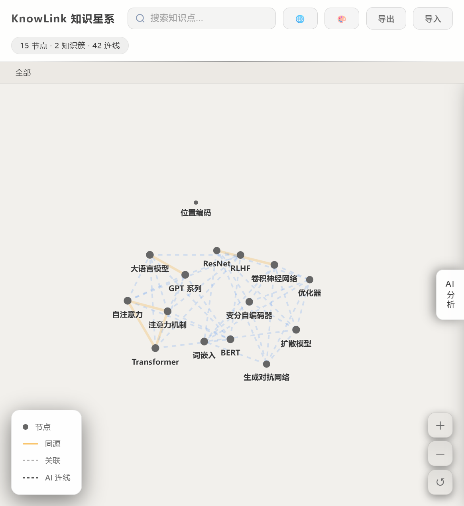
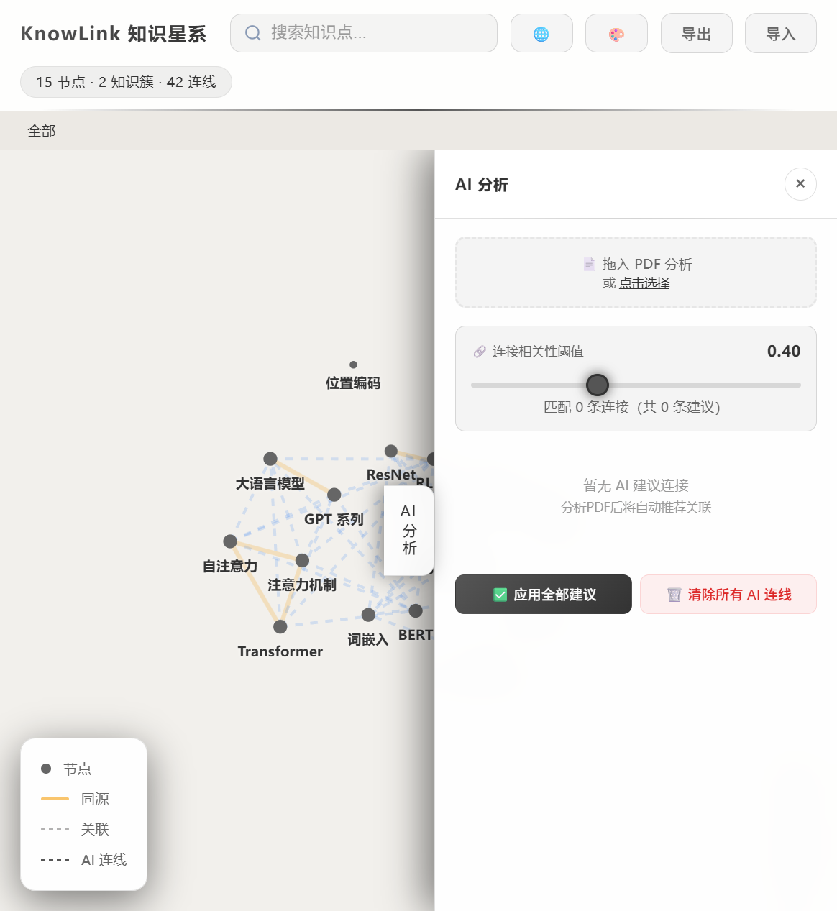
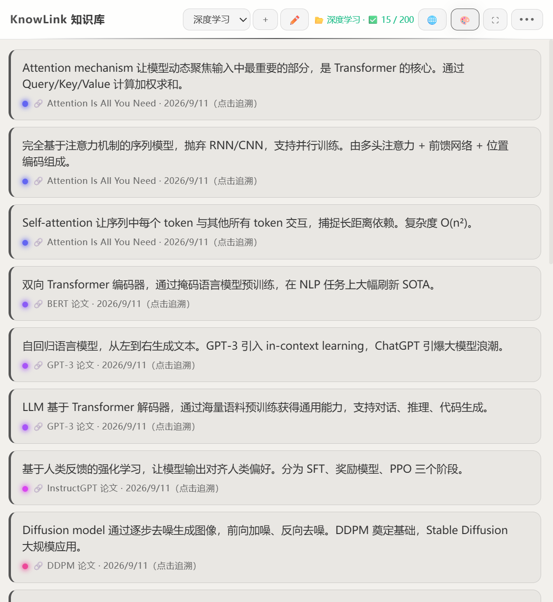
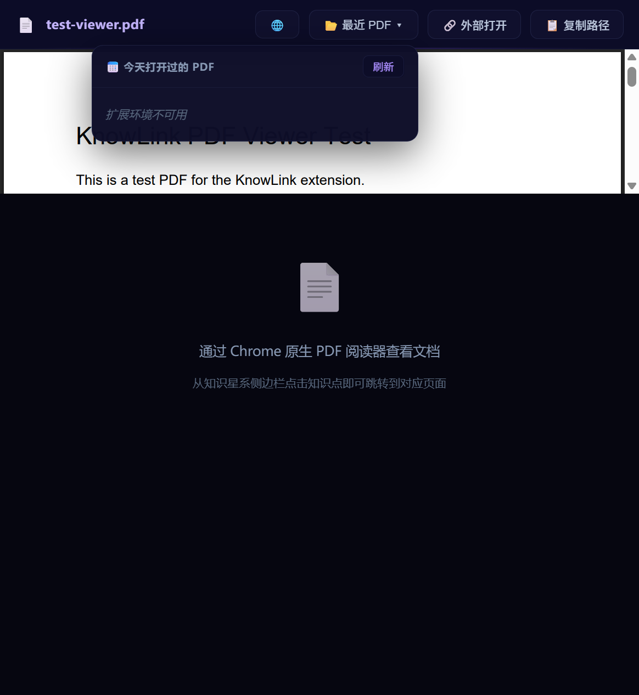

# KnowLink 知识星系 (Knowledge Galaxy)

> Chrome Extension · Manifest V3 · Knowledge Visualization


[中文文档](./README.zh-CN.md) · [Knowlink Page (HTML Page Generator)](https://github.com/Wizeeeee/knowlink-skill)

This project started from exam review while flipping through a pile of PDF courseware, I kept accidentally closing the browser and had to hunt for the files again. The rest of the features grew out of experiments with AI and Obsidian. This is my first open-source project — any suggestions and questions are welcome.

## Features

- **Knowledge galaxy visualization**: knowledge points rendered as nodes, relations as edges, automatically clustered into knowledge clusters
- **Smart PDF analysis**: drag in a PDF to auto-extract knowledge points, generate summaries, and discover relations (cloud AI optional)
- **Semantic deduplication**: TF-IDF + cosine similarity to avoid duplicate knowledge points
- **AI analysis**: discover hidden relations across knowledge bases, apply with one click
- **Multiple views**: Side Panel + fullscreen galaxy (Network) + PDF viewer
- **Custom API**: supports any OpenAI-compatible API endpoint

## Screenshots

**Fullscreen galaxy (Network view)** — knowledge points as stars, relations as edges, auto-clustered into galaxies:



**AI wormhole drawer** — relation discovery suggestions with a relevance threshold slider:



**Side panel** — knowledge base list, search, PDF analysis:



**PDF viewer** — opens PDFs via Chrome's native reader:



## Quick Start

### Install (Option 1: Download Release ZIP)

1. Go to [Releases](https://github.com/Wizeeeee/knowlink-view/releases) and download the latest `knowlink-view-<version>.zip`
2. Unzip it to any local directory
3. Open Chrome and visit `chrome://extensions/`
4. Enable **Developer mode** (top right)
5. Click **Load unpacked** and select the unzipped directory
6. Click the extension icon in the toolbar — the side panel opens

### Install (Option 2: Developer Mode)

1. Clone the repo and enter the directory:
   ```bash
   git clone https://github.com/Wizeeeee/knowlink-view.git
   cd knowlink-view
   ```
2. Open Chrome and visit `chrome://extensions/`
3. Enable **Developer mode** (top right)
4. Click **Load unpacked** and select the `knowlink-view/` directory
5. Click the extension icon in the toolbar — the side panel opens

### Configure AI (Optional)

Cloud AI features (PDF summaries, relation discovery) need an API Key:

```bash
# Copy the config template
cp js/core/ai-config.example.js js/core/ai-config.js
```

Edit `js/core/ai-config.js`:

```js
var DEFAULT_CONFIG = {
  provider: 'custom',     // custom API
  apiKey: 'your-api-key-here',  // put your API Key here
  endpoint: 'https://api.example.com/v1/chat/completions',  // your API endpoint
  model: 'your-model-name',     // your model name
  enabled: true           // set to true after adding your key
};
```

> `ai-config.js` is in `.gitignore` — **never** commit your API Key.

Core features work without AI (the local NLP engine handles keyword extraction, deduplication, and edge computation).

## Project Structure

```
knowlink-view/
├── manifest.json            Chrome Extension Manifest V3
├── background.js            Service Worker (data layer + tab listeners)
├── content.js               Content Script (page injection)
├── sidepanel.html           Side panel UI
├── network.html             Fullscreen galaxy UI
├── pdf-viewer.html          PDF viewer UI
├── js/
│   ├── core/                Engine / data layer (no UI dependencies)
│   │   ├── nlp-engine.js    Unified NLP engine (TF-IDF / TextRank / cosine similarity)
│   │   ├── cloud-adapter.js Cloud API adapter (Map-Reduce summarization / retry backoff)
│   │   ├── ai-store.js      AI result persistence
│   │   ├── ai-edges.js      AI edge CRUD
│   │   ├── ai-dedup.js      Semantic dedup (delegates to nlp-engine)
│   │   ├── ai-worker.js     Web Worker (delegates to nlp-engine)
│   │   ├── ai-wormhole.js   AI analysis orchestrator (PDF analysis / relation discovery)
│   │   ├── ai-config.js     AI config (gitignored, not committed)
│   │   ├── kb-store.js      Unified knowledge base data layer (single source of truth)
│   │   ├── knowlink-layout.js  Graph computation & layout engine
│   │   ├── knowlink-renderer.js Canvas 2D rendering pipeline
│   │   ├── knowlink-engine.js KnowLinkAI API thin facade
│   │   ├── i18n.js          Internationalization
│   │   └── utils.js         Shared utilities
│   └── views/               View logic
│       ├── sidepanel.js     Side panel logic
│       ├── network.js       Fullscreen galaxy logic
│       └── pdf-viewer.js    PDF viewer logic
└── lib/                     Third-party libraries (PDF.js)
```

Detailed architecture (module dependency graph, evolution) in [PROJECT_STRUCTURE.md](./PROJECT_STRUCTURE.md).

## Architecture

- **Clean layering**: `js/core` has no UI dependencies; `js/views` only handles view logic
- **Single source of truth**: all `chrome.storage` access is centralized in `kb-store.js`
- **Unified NLP**: TF-IDF / TextRank / dedup all delegate to `nlp-engine.js`, eliminating duplicate implementations
- **AI orchestration**: `ai-wormhole.js` orchestrates the PDF analysis flow; `cloud-adapter.js` handles API calls

## Related Projects

- **[Knowlink Page](https://github.com/Wizeeeee/knowlink-skill)** — Knowledge galaxy page generator (CLI + Skill). Turns knowledge-point JSON specs into self-contained interactive HTML pages, sharing the same knowledge-point data model and layout/render engine with this extension.

## Development

### Requirements

- Chrome / Edge (Manifest V3 + Side Panel API)
- No build tools — pure vanilla JS

### Workflow

1. After editing code, click **Reload** on the extension in `chrome://extensions/`
2. Open DevTools and look for `[KnowLink BG]` / `[KnowLink]` prefixed logs
3. When adding a new JS file, remember to update `web_accessible_resources` in `manifest.json`

### Code Style

- Vanilla ES5/ES6 (no frameworks, no build step)
- Global namespaces: `self.KBStore` / `window.AIWormhole` / `window.NLP` / `window.AIConfig`
- Log prefixes: `[KnowLink BG]` (background) / `[KnowLink]` (views)

## Contributing

Issues and Pull Requests are welcome!

## License

[MIT](./LICENSE)